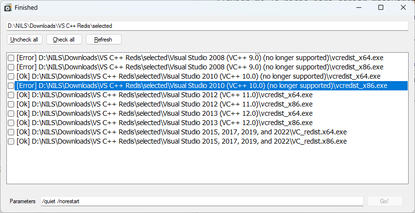

# Bulk-Sequential-Launcher

Programita sencillo para ejecutar secuencialmente un listado de ejecutables que selecciones de una carpeta (EXE, MSI, MSU y CAB).

- Alguien me lo pidió para copiar masivamente updates de WSUS y ejecutarlos a viaje en otra PC. Yo se lo di, pero no lo recomiendo si no estás seguro de que esos updates son aplicables a tu PC o esos ejecutables no son maliciosos.

- Espera que se termine de ejecutar uno para ejecutar el siguiente.

- Hecho para una ejecución no oficial burda de updates en una carpeta. Use at your own risk. Te marca por defecto los ficheros que estén el a carpeta y subcarpetas que él "supuestamente sabe" ejecutar. Eso incluye EXE, MSI, MSU y CAB. 

- usar en el cuadro de parámetros `/quiet /passive /norestart`. Parámetros comunes en updates e instaladores para ejecutar en lote.

*Ejemplo ejecutando varias versiones de vc++ redistributable packages*

## TO DO

- Capturar la salida, especialmente en casos de error.

